### analise_de_risco
* **Ausência de Autenticação Transacional:** O requisito não menciona a solicitação de senha (PIN) ou biometria antes de confirmar o agendamento. Realizar transações financeiras futuras sem confirmação de segurança é um risco crítico de fraude.
* **Falta de Definição de Localização para o Cancelamento:** O PO pede um botão para "cancelar depois", mas não especificou onde esses agendamentos ficam listados. É necessário criar uma área de "Lançamentos Futuros" ou integrar ao "Extrato" para que o usuário encontre esse botão após fechar a tela de sucesso.
* **Fuso Horário (Timezone):** A regra de "não agendar para o mesmo dia" pode gerar bugs graves entre 23:00 e 00:00 se o Frontend usar a hora local do dispositivo do usuário ao invés do horário dos servidores do BACEN/Banco (Brasília).
* **Idempotência e Prevenção de Duplicidade:** Risco do usuário clicar múltiplas vezes no botão "Confirmar" e o app gerar vários agendamentos repetidos caso não haja bloqueio de UI e controle de idempotência na API.

### mapeamento_de_estados
**1. Estados de Carregamento (Loading)**
* **`FetchingContacts`:** Skeleton ou Spinner enquanto a lista de contatos frequentes é carregada.
* **`ValidatingLimit`:** Indicador sutil de carregamento ao selecionar a data, para consultar se há limite disponível naquele dia específico.
* **`ProcessingSchedule`:** Botão "Confirmar" desabilitado com spinner interno durante o request para evitar duplo envio.
* **`CancelingSchedule`:** Overlay bloqueando a tela na área de gestão ao clicar em "Cancelar agendamento".

**2. Estados Vazios (Empty States)**
* **`EmptyContacts`:** Quando o usuário não tem nenhum contato salvo, exibindo um CTA: "Inserir nova chave Pix".
* **`EmptySchedules`:** Na tela de gestão/extrato, caso não haja nenhum agendamento futuro.

**3. Estados de Erro (Error States)**
* **`DateValidationError`:** Feedback visual no calendário (inline) se o usuário tentar burlar ou forçar uma data inválida/passada.
* **`LimitExceededError`:** Mensagem clara no input numérico se o valor digitado ultrapassar o limite de R$ 5.000,00 ou o limite restante para a data escolhida.
* **`NetworkError`:** Toast ou Bottom Sheet de erro (com botão de *Retry*) caso a API caia na hora de confirmar.
* **`CancelationTimeoutError`:** Erro amigável se a tentativa de cancelamento falhar por instabilidade.

### cenarios_ocultos
**Caminhos Felizes (Happy Paths) Ocultos:**
* **Compartilhamento de Comprovante:** Após o sucesso, o usuário vai querer compartilhar o comprovante de *agendamento* (que deve ser visualmente diferente de um comprovante de *efetivação*).
* **Redirecionamento Inteligente:** Se o usuário clicar no dia "Hoje" no calendário, o app pode sugerir educadamente um atalho: "Deseja fazer um Pix agora? Ir para Pix Imediato".

**Caminhos Infelizes (Unhappy Paths) Ocultos:**
* **Saldo Insuficiente no Momento do Agendamento:** O usuário tem R$ 0,00 hoje, mas quer agendar R$ 1.000,00 para o dia 15. O Front-end *não* deve bloquear, mas deve exibir um Warning: "Lembre-se de ter saldo no dia [Data] para que o Pix seja efetivado".
* **Soma de Múltiplos Agendamentos:** O usuário agenda R$ 3.000,00 para o dia 20. Depois, tenta agendar mais R$ 3.000,00 para o mesmo dia 20. O Front-end precisa somar isso e bloquear a segunda transação, avisando que o limite de 5k diário para aquela data estourou.
* **Tentativa de Cancelamento Tardia:** O usuário tenta cancelar no dia em que o Pix já está em processamento (ex: às 02:00 da manhã do dia agendado). O botão de cancelar deve sumir ou retornar um erro claro: "Este Pix já está em processamento e não pode ser cancelado".

### regras_de_negocio
* **Conflito na Regra do Limite de 5K:** A regra diz "O limite diário é R$ 5.000,00". No entanto, o Front-end deve consumir o limite do dia da **criação** do agendamento ou do dia da **execução**? No BACEN, limites são por data de liquidação. A interface deve garantir validação da data futura, não da atual.
* **A Regra "Pix Normal no Mesmo Dia":** Em vez de tratar isso como um erro de formulário, a regra de negócio deve ser transformada em regra de UI: o componente de *DatePicker* deve vir obrigatoriamente com o dia atual desabilitado (`minDate = Hoje + 1 dia`), evitando que o usuário sequer cometa o erro.
* **Limites Noturnos Inseguros:** A regra estática de "5 mil diário" ignora resoluções de segurança do BACEN sobre limites noturnos (geralmente entre 20h e 06h, limitados a R$ 1.000,00). O Front-end precisará prever uma mensagem de alerta caso o agendamento esbarre em regras de horário noturno no dia da efetivação.

```mermaid
graph TD
    %% Definições de Estilo
    classDef error fill:#f96,stroke:#333,stroke-width:2px;
    classDef success fill:#9f6,stroke:#333,stroke-width:2px;
    classDef warning fill:#fff59d,stroke:#fbc02d,stroke-width:2px;
    classDef uiState fill:#e1f5fe,stroke:#01579b,stroke-width:1px;
    classDef process fill:#fff,stroke:#333,stroke-width:1px;

    %% Início e Seleção de Contato
    Start((Início)) --> FetchContacts[Buscar Contatos Salvos]
    FetchContacts --> LoadingContacts[UI: Skeleton FetchingContacts]:::uiState
    LoadingContacts --> HasContacts{Possui contatos?}

    HasContacts -- Não --> EmptyContacts[UI: Empty State - Inserir Nova Chave]:::uiState
    EmptyContacts --> InputKey[Inserir Chave Manualmente]
    HasContacts -- Sim --> SelectContact[Selecionar Contato da Lista]
    
    InputKey --> InputAmount[Inserir Valor do Agendamento]
    SelectContact --> InputAmount

    %% Data e Validação de Limites
    InputAmount --> SelectDate[Selecionar Data Futura minDate=D+1]
    SelectDate --> LoadingLimit[UI: Spinner ValidatingLimit]:::uiState
    LoadingLimit --> CheckLimit{Valor + Agendados > R$ 5k?}

    CheckLimit -- Sim --> LimitError[UI: Erro - LimitExceededError]:::error
    LimitError --> InputAmount

    CheckLimit -- Não --> CheckBalance{Saldo Atual Suficiente?}
    
    %% Tratamento de Saldo e Revisão
    CheckBalance -- Não --> WarningBalance[UI: Warning - Aviso de Saldo Futuro]:::warning
    WarningBalance --> ReviewScreen[UI: Tela de Revisão dos Dados]:::uiState
    CheckBalance -- Sim --> ReviewScreen

    %% Autenticação e Confirmação
    ReviewScreen --> ConfirmAction[Ação: Clicar em Confirmar]
    ConfirmAction --> MFA[Processo: Autenticação PIN/Biometria]
    
    MFA --> AuthSuccess{Senha correta?}
    AuthSuccess -- Não --> AuthError[UI: Erro - Senha Incorreta]:::error
    AuthError --> MFA
    
    %% Chamada de API Criação
    AuthSuccess -- Sim --> PostSchedule[API: POST /pix/schedule]
    PostSchedule --> Processing[UI: Overlay ProcessingSchedule]:::uiState
    Processing --> APIResponse{Retorno da API}

    %% Respostas de API Criação
    APIResponse -- Timeout/Network --> TimeoutError[UI: Erro - NetworkError com Retry]:::error
    APIResponse -- 4xx / 5xx --> ServerError[UI: Erro Genérico de Agendamento]:::error
    APIResponse -- 201 Created --> SuccessScreen[UI: Sucesso - Comprovante de Agendamento]:::success

    TimeoutError -.-> ConfirmAction
    ServerError -.-> ConfirmAction

    %% Fluxo Pós-Sucesso e Gestão
    SuccessScreen --> ShareReceipt[Ação: Compartilhar Comprovante]
    SuccessScreen --> GoToSchedules[Ação: Acessar Lançamentos Futuros]

    GoToSchedules --> FetchSchedules[Buscar Agendamentos]
    FetchSchedules --> HasSchedules{Possui Agendamentos?}
    HasSchedules -- Não --> EmptySchedules[UI: Empty State - EmptySchedules]:::uiState
    HasSchedules -- Sim --> ViewSchedule[Ação: Ver Detalhes do Agendamento]

    %% Fluxo de Cancelamento
    ViewSchedule --> ClickCancel[Ação: Clicar em Cancelar]
    ClickCancel --> CheckStatus{Status == PROCESSING?}
    
    CheckStatus -- Sim --> CancelForbidden[UI: Erro - Já em Processamento]:::error
    CheckStatus -- Não --> DeleteSchedule[API: DELETE /pix/schedule/:id]
    
    DeleteSchedule --> CancelingUI[UI: Overlay CancelingSchedule]:::uiState
    CancelingUI --> CancelResponse{Retorno Cancelamento}

    %% Respostas de API Cancelamento
    CancelResponse -- Timeout/Erro --> CancelError[UI: Erro - CancelationTimeoutError]:::error
    CancelResponse -- 200 OK --> CancelSuccess[UI: Sucesso - Agendamento Cancelado]:::success
    
    CancelError -.-> ClickCancel
    CancelSuccess -.-> GoToSchedules
```

