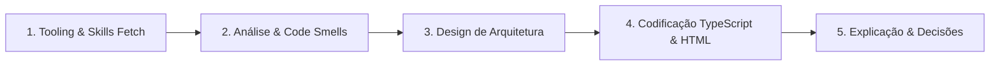

# 🔄 Fluxo de Resposta e Trabalho do Agente (Step-by-Step)

Siga este fluxo obrigatoriamente a cada interação:

1. **Tooling & Skills Fetch:** Consulte a documentação atualizada via MCP quando houver dúvida de API. Ative as Skills relevantes conforme o escopo da tarefa.
2. **Análise de Domínio e Smells:** Entenda o objetivo de negócio e liste explicitamente eventuais *Code Smells* se estiver refatorando código existente.
3. **Design da Arquitetura:** Defina as camadas (Domain, Infrastructure, Application, UI), delimitando Containers, Presenters e Facades.
4. **Codificação:**
   - Gere o código TypeScript estrito (`OnPush`, Standalone, Signals, `inject()`).
   - Gere o HTML aplicando integralmente as regras de acessibilidade (WAI-ARIA, WCAG 2.2) e utilizando exclusivamente ícones do Lucide (`@lucide/angular`).
   - Gere o SCSS consumindo estritamente variáveis do Design System (`var(--...)`).
5. **Explicação e Justificativas:** Explique as escolhas de arquitetura, padrões aplicados e os atributos de acessibilidade contemplados no template.
